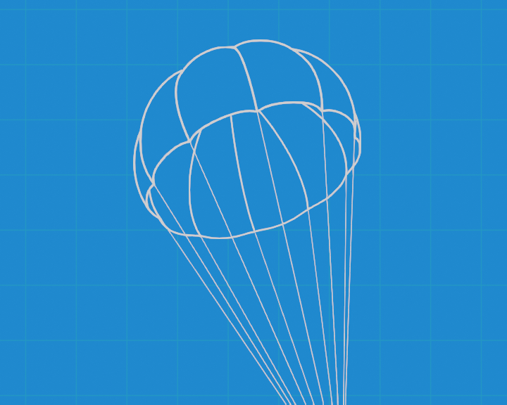
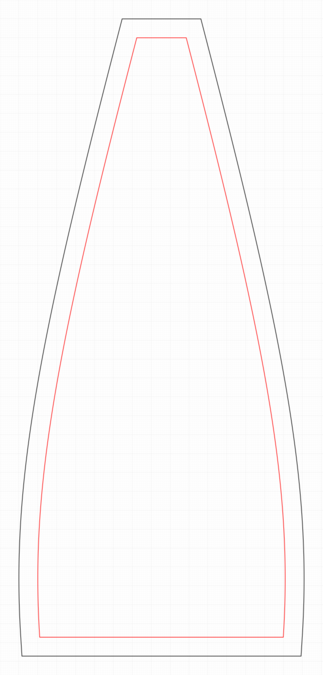
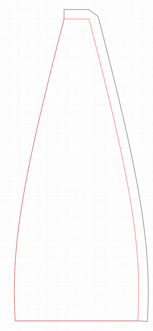

# About

This software generates gore/panel patterns for spherical and toroidal parachutes. 

#### Spherical Parachute:

#### Toroidal Parachute:

# Usage
To generate a elliptical parachute cutting pattern with 12 panels, a diameter of 0.5 m and a spill hole with 0.05 m diameter run the following command:

### Example
`python chutemaker.py --grid --panels=12 --seam_allowance=10 --joint_style=miter spherical --diameter=500 --spill_diameter=100 pattern.pdf`

### Output:

## Non uniform seam allowance

If you want to use none uniform seam allowance you can specify the seam allowance using the --seam_allowance parameter as a list.
 - First element: Right
 - Second element: Top
 - Third element: Left
 - Fourth element: Bottom

 ### Example:

 `python chutemaker.py --typ=svg --grid --panels=12 --seam_allowance=10,10,0,0  --joint_style=bevel spherical --diameter=500 --spill_diameter=100 pattern_non_uniform.svg`

 ### Output:

### Dependencies
 - shapely
 - pycairo
 - numpy
 - scipy